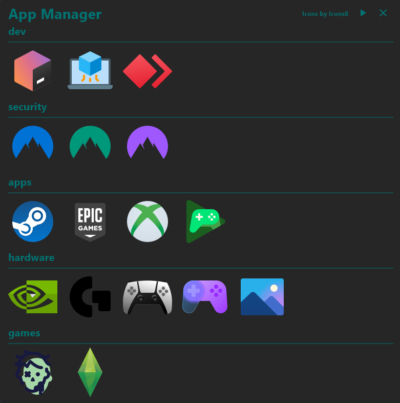

# App Manager v1.4.1
**(atualizado em: 04/11/2024)**

O App Manager é uma ferramenta projetada para simplificar a gestão de aplicativos em sistemas operacionais Windows.
Com interface intuitiva, este aplicativo oferece uma maneira conveniente e centralizada de gerenciar 
e acessar todos os seus aplicativos instalados.

## Exemplos:



## Principais Recursos:
- **Visualização Organizada**: O aplicativo apresenta visualização de todos os aplicativos instalados no sistema, 
que já foram mapeados, facilitando a localização e o acesso rápido aos programas desejados.


- **Categorias Personalizadas**: Os aplicativos podem ser organizados em categorias personalizadas,
permitindo que os usuários agrupem aplicativos de acordo com suas preferências e necessidades específicas.


- **Pesquisa Rápida**: Com a funcionalidade de pesquisa integrada,
os usuários podem encontrar facilmente aplicativos específicos,
apenas digitando parte do nome ou palavra-chave relacionada. **(Em breve)**

- **Personalização Avançada**: O aplicativo oferece opções de personalização avançadas,
permitindo que os usuários ajustem o layout, cores e outras configurações,
de acordo com suas preferências individuais. **(Em breve)**

## Benefícios:
- **Eficiência**: Economiza tempo e esforço dos usuários.


- **Praticidade**: Simplifica a gestão de aplicativos, gerindo todos em um só lugar.

## Como Configurar:

- Comece copiando o esquema de pastas e arquivos que estão localizados dentro de example.
(Se quiser gerar um novo build os arquivos copiados deveram ser os scripts, logos, config.json).

- Coloque todos os atalhos dentro da pasta **shortcut**

- Coloque todos os icones dentro da pasta **icons**

- Ajuste o config.json para o que queira que seja refletido dentro do app.

## Como Usar:

- O usuario devera entrar no app e então escolher o app que deseja abrir, o aplicativo abrira o app e fechara sozinho.

## Comandos pertinentes:

```bash
flutter clean
```

```bash
flutter pub get
```

```bash
flutter config --enable-windows-desktop
```

```bash
flutter create --platforms=windows,macos,linux .
```

```bash
flutter run -d windows
```

```bash
flutter build windows
```

## Linguagens Utilizadas:
* [Flutter: 3.24.3](https://flutter.dev/?gclsrc=aw.ds)

## Libs Utilizadas:
* [process_run: ^1.2.2](https://pub.dev/packages/process_run)
* [url_launcher: ^6.3.1](https://pub.dev/packages/url_launcher)
* [window_manager: ^0.4.3](https://pub.dev/packages/window_manager)
* [shared_preferences: ^2.3.2](https://pub.dev/packages/shared_preferences)
* [flutter_svg: ^2.0.11](https://pub.dev/packages/flutter_svg)

## Site Para Imagens:
* [Icons8](https://icons8.com.br/)

## Contato:

Para perguntas, feedback ou suporte, entre em contato conosco em bmb.bezerra0@gmail.com
Para saber mais entre em https://bmb-portfolio.dev
